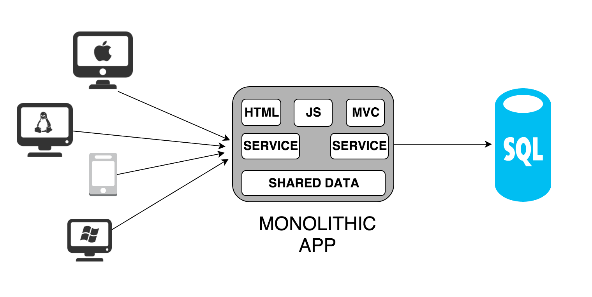
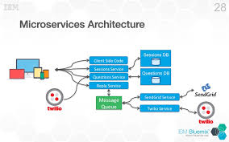

* Notes préalables
* Objectifs
* Qu'est ce que monilithique ?
  * Présentation
  * Architecture générale
  * Avanatges
  * Inconvénients
* Les microservices, une révolution !
  * Présentation
  * Architecture générale
  * Quelques sociétés qui ont migré vers les microservices
  * Avantages 
  * Inconvénients
* L'écosystème des microservices
  * Frameworks de développement
  * Outils de déploiement
  * Outils de conteneurisation 
  * Outils de mise en production
  * Outils de monitoring
* Conclusion
* Webographie

# Notes préalables
Ce document écrit constitue le résultat de ma veille technologique que j'ai faite dans le cadre du cours MSO 4.4.
Vous pouvez retrouvez le support de présentation au format ppt et pdf.

Retrouvez mon compte [Twitter](https://twitter.com/oualidbouh) sur lequel j’ai partagé des liens en rapport avec le sujet de ma veille.
# Objectifs
A travers cette veille technologique, j’ai choisi d'expliquer qu'est-ce qu'une architecture microservice, ainsi que les outils utilisés dans l'industrie digitale pour créer des applications très robustes et scalables.

Cette synthèse s’articule en trois grandes parties, Dans la première nous verrons une explication concernant l'architecture d'une application classique dite **monolithique**, avec les avanatges et inconvénients de cette dernière.
Dans la deuxième, nous plongerons ensemble dans l' architecture microservice, nous verrons dans cette parties une défintion de ce style d'application avec ces avantages et inconvénients ainsi que quelques exemples d'applications implémentant cette architecture.
Finalment pour la troisième, nous verrons l'écosystème des microservices du développement jusqu'au déploiement.

# Qu'est ce que monilithique ?
## Présentation
Dans le monde du génie logiciel, une application qui suit l'architecture monolithique à un seul niveau dans laquelle l'interface utilisateur et la logique métier et la couche d'accés aux données sont combinés dans un seul programme avec une seule technologie (un backend avec une seule technologies, ça pourra être du JAVA, PHP) et avec une seule suite de test (unitaire, sécurité, non regression..etc) et avec une seule et unique plateforme de déploiement.
## Architecture monolithique
Cette figure montre à quoi ressemble une application avec l'architecture monolithique : 

Géneralement, nous pouvons découpler une application en monolithque en trois couches.
La première est la couche de présentation, cette couche peut être sous la forme d'une application Web ou d'une application Mobile, elle permet d'intercepter les actions de l'utilisateur tel que la saisi et suppression par exemple. la deuxième est la couche applicative, cette dernière contient la logique métier de l'application, elle interégie directement avec la couche précedente à l'aide du protocole **HTTP** donc elle intercepte les actions utilisateurs et les execute. La troisième couche est la couche de données qui permet l'accées au serveur de base de données pour recupérer, modifier, supprimer ou mettre à jours les données.
## Avantages
L'architecture monolithique est la plus répandue dans les projets informatique. Parmis les raisons qui explique ce fait, nous distingons la facilité du débogage puisque le code n'est pas éparpillé, ensuite nous trouvons la facilité du test de l'application, ensuite la faciliter du développement.
## Inconvénients
Parmis les inconvénients des applications monolithiques, il existe le temps de build qui est généralements très long pour des les grosses applications, ensuite il faut redeployer l'application tout en entier. Au long d'un projet de développement d'une application monolithique, l'ajout de nouvelles fonctionnalités est parfois très complexe dire impossible, lorsqu'un nouveau collaborateur rejoint une équipe de développement, il trouve beaucoup de difficultés à comprendre la logique du code écrit. 
# Les microservices, une révolution !

## Présention
L'architecture microservice désigne une application dont les services sont distribués et découplés et focalisés et modulaires chacun sur une fonctionnalité bien précise, ces mini applications doivent être déployées de manière indépendante l'une des autres. Ce style d'architecture s'inspire de l'architecture orienté service **SOA**.
## Architecture générale
Comme déjà cité dans la présentation des architecures microservices, l'application en coupé en micro-applications dites services, chacun de ces services a son propre serveur de base de données. ces services peuvent communiquer entre eux grâce à differents protocoles tel que HTTP pour les appeles REST ou bien le protocole SOAP, sinon le protocole **AMQP**.
Voici un exemple d'architecture en microservices :

## Quelques sociétés qui ont migré vers les microservices
Plusieurs sont les entreprises qui ont migré vers des applications en microservices, parmis ces entreptise nous trouvons le géant **NETFLIX** pour les séries et films en ligne, qui est passé de la livraison des DVD qui était trop lente à une architecture microservice en Cloud pour le streaming des vidéos. **Uber** ont eux aussi migrer vers une architecture en microservices à fin de gérer le traffic croissant et d'ajouter de nouvelles fonctionnalités à l'application facilement.

## Avantages
Parmis les avantage des microservices nous trouvons l'utilisation des ressources de traitement qui est plus optimisée gràce à la scalabilité verticale (ajout de mémoire RAM, processeur, disque de stockage..etc), ensuite nous trouvons l'ajout des nouvelles fonctionnalités ou la correction des anomalies et bugs qui sont plus faciles dans ce cas car les développeurs connaissent préalablement le service à mettre à jour ou à corriger. par la suite, nous trouvons le déploiement continu qui est possible avec les application en microserices, ce qui permet aux sociétés de booster le time to delivery.

## Inconvénients
Comme déjà cité, dans une application en microservices, chaque composant applicatif a sa propre base de données (base de données cloisonée), ce qui rend la conception de la base et sa mise à jour au fur et à mesure au cour du projet très complexes, ajoutons à ceci les transactions qui doivent être synchronisées entre les différentes base de données. ensuite, le second inconvénient est le test de l'application qui est très difficile et fastidieux. ensuite, le debogage pour la correction des anomalies est copmpliqué car parfois le développeur ne peux pas connaître la source du problème car cette dernière pourra être une anomalie applicative ou bien une anomalie provenant du réseau (congestion du réseau).
# L'écosystème des microservices

## Frameworks de développement

## Outils de déploiement

## Outils de conteneurisation

## Outils de mise en production

## Outils de monitoring

# Conclusion

# Webographie
